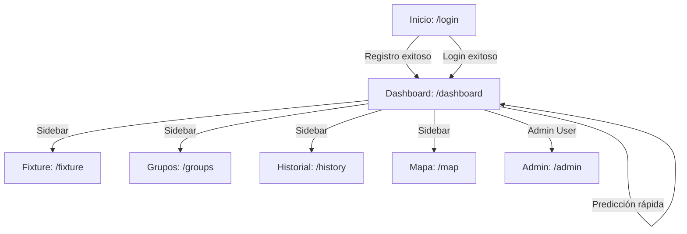

# Flujos de Usuario Implementados

El frontend implementa y valida los flujos funcionales del negocio:

## 1. Registro e Inicio de Sesión
- **Validación del Cliente:** El formulario de registro verifica de forma interactiva en la UI que la contraseña cumpla los requisitos de seguridad del backend (mínimo 10 caracteres, una mayúscula y un número).
- **Mapeo de Campos:** Mapea el campo de interfaz `fullName` al campo `name` requerido por el backend.
- **Redirección:** Al finalizar el registro, almacena automáticamente el token JWT y redirige de forma transparente al Dashboard.

## 2. Realización y Modificación de Pronósticos
- **Predicción Rápida (Dashboard):** El Bento Grid del Dashboard lista únicamente partidos con estado `scheduled` cuya fecha/hora de inicio sea posterior a la actual y que el usuario **no haya pronosticado aún**.
- **Calendario Completo (Fixture):** Lista todos los partidos cruzándolos con la respuesta de `GET /predictions/me`.
    - Si existe un pronóstico para el partido: Muestra los marcadores predichos y cambia el botón a **Modificar**. Al guardar, se ejecuta `PATCH /predictions/:id`.
    - Si no existe: Muestra "Sin pronosticar". Al guardar, se ejecuta `POST /predictions`.
- **Cierre Automático:** Si el partido comenzó o su estado no es `scheduled`, los campos de entrada y el botón de guardar se bloquean automáticamente tanto en la tarjeta como en el modal de predicción.

## 3. Administración de Grupos
- **Clasificación y Puntuación:** Mapea de forma dinámica la posición en tiempo real obtenida del motor de clasificación por grupos.
- **Invitaciones:** Permite a los usuarios dueños del grupo ver y copiar al portapapeles el código de invitación privado (NMZOG53J) generado en el backend.

## 4. Panel de Administración
- **Seguridad:** Protegido a nivel cliente para evitar renderizado a usuarios normales.
- **Sincronización:** Permite disparar manualmente la actualización del día. Actualiza la tabla visual de ejecuciones anteriores recuperando el campo `startedAt` para prevenir problemas de fechas nulas.
